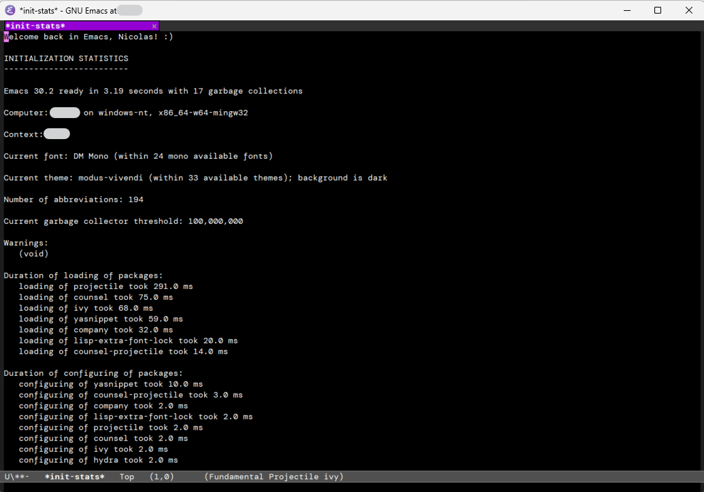
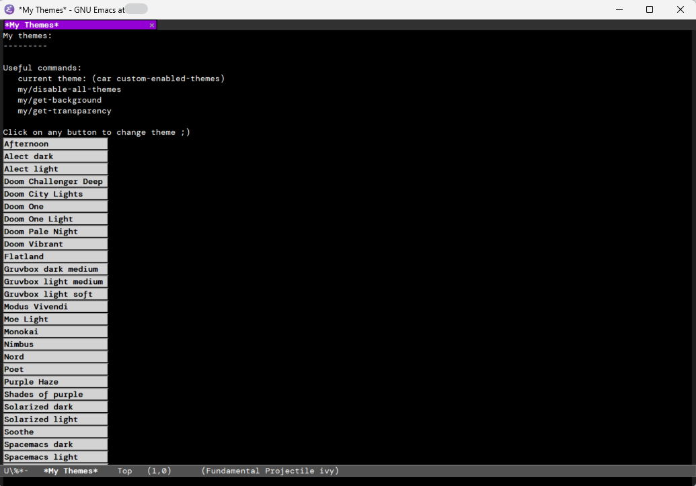
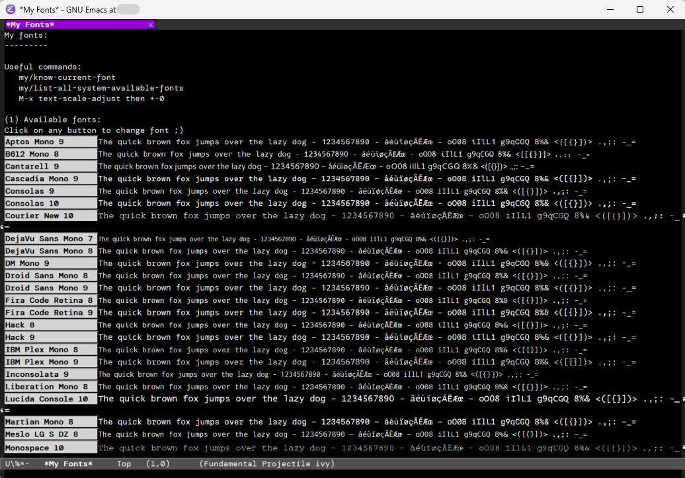

# emacs-config

This is my _actual_ **init.el** file, on **Windows**.

I use the _same_ configuration file (stored on cloud) on my different computers.

I make no claim whatsoever that it could serve as a reference. It’s simply the result of several years of personal configuration of Emacs to my needs. Emacs is my everyday main work tool.

It’s probably not forkable as is, since it relies on _(i)_ a few external executables and _(ii)_ personal paths. See the `Paths to directories and files` section in the code.

Some comments in the file have probably become outdated over time.

What I like about my configuration:

**(1)** The loading time is quite short: < 3 s on my (standard) laptop, despite the 7K+ lines of code. Loading of many packages is deferred.

**(2)** Just after startup, a dedicated buffer provides a summary of the initialization process, the time spent loading each package, and executing each section of init.el. In case of initalization slowdown, this makes analysis easier. See screenshot below.

**(3)** I’ve tried to create a mode-specific hydra for each mode, which can always be triggered _with the same keystroke_ (`C-c d`). See `mode-dependent hydra launcher` in the code.

**(4)** A buffer with buttons allows for easy testing of themes. See screenshot below.

**(5)** A buffer with buttons allows for easy testing of fonts. See screenshot below.

**(6)** Specific functions make it easy to work with pdf or zip files within Dired.

**(7)** Based on a tailored function, `C-c c` kills (copies to clipboard) the most relevant current text: word, inline code, org-mode block, etc. depending on the context.

**(8)** Fine-tuning of Emacs as Emacs Lisp and Common Lisp IDE

**(9)** Easy copy/paste with formatting from/to external applications

Any comment? Open an [issue](https://github.com/occisn/emacs-config/issues), or start a discussion [here](https://github.com/occisn/emacs-config/discussions) or [at profile level](https://github.com/occisn/occisn/discussions).

Just below: screenshot corresponding to (2): buffer summarizing the initialization.

Just below: screenshot corresponding to (4): buffer with buttons to switch themes.

Just below: screenshot corresponding to (5): buffer with buttons to switch fonts.

(end of README)
